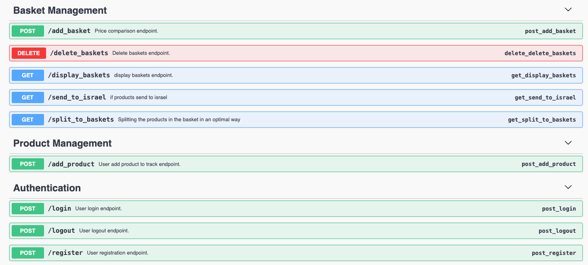

## Description

The Backend api platform that connects to retail websites and automatically analyzes data according to customer requests. The analysis includes prices, promotions, coupons, optimal order splitting, product recommendations, and shopping cart comparison. 
The platform was developed using: Python, Beautiful Soup and Selenium ,MySQL ,SQLAlchemy Flask (REST APIs) and designed using object-oriented programming (OOP) concepts.

## Features and Functionality

1. **Project Kick-off and Planning:**
   - *Define Project Scope:* Clearly outline the features and functionalities to be implemented.
   - *Define Requirements:* Specify user stories and technical requirements for a detailed roadmap.
   - *Set Milestones:* Break down the project into manageable milestones for effective project management.

2. **Environment Setup:**
   - *Setup Flask Application:* Create a structured Flask project to serve as the foundation.
   - *Database Setup:* Establish a MySQL database schema integrated with Flask using SQLAlchemy.

3. **User System:**
   - *User Authentication:* Implement secure user registration and login processes.
   - *User Dashboard:* Develop an interactive dashboard for users to manage their preferences and monitored products.

4. **Web Scraping Setup:**
   - *Install Required Libraries:* Set up BeautifulSoup, Selenium, and Requests for web scraping.
   - *Implement Web Scraping:* Develop scripts to scrape product information from asos.com while ensuring compliance with website terms.

5. **Data Storage:**
   - *Store Scraped Data:* Design and implement a robust database schema to efficiently store scraped product data.

6. **Price Monitoring Logic:**
   - *Markdown Basics:* Understanding Markdown, the language for creating ReadMe files, is essential. Markdown offers syntax for headings, code blocks, links, lists, and even inline HTML. It provides a structured and readable format for ReadMe files.
   - *Define Monitoring Rules:* Specify criteria for identifying significant price drops.
   - *Implement Monitoring:* Develop a sophisticated system to regularly check for price changes and trigger alerts accordingly.
   - *Notify users of drops:* Implement a notification system, considering email notifications or in-app alerts.

7. **User Notifications:**
   - *Notification System:* Implement alerts for users based on their preferences and monitoring criteria.

8. **Deployment:**
   - *Deployment Plan:* Strategize the deployment process to ensure a smooth transition to the production environment.
   - *Server Configuration:* Configure the server for optimal performance and reliability.

9. **Monitoring and Maintenance:**
   - *Monitoring Tools:* Implement tools for monitoring the performance and health of the system.
   - *Maintenance Plan:* Develop a plan for ongoing updates, improvements, and overall system maintenance.

